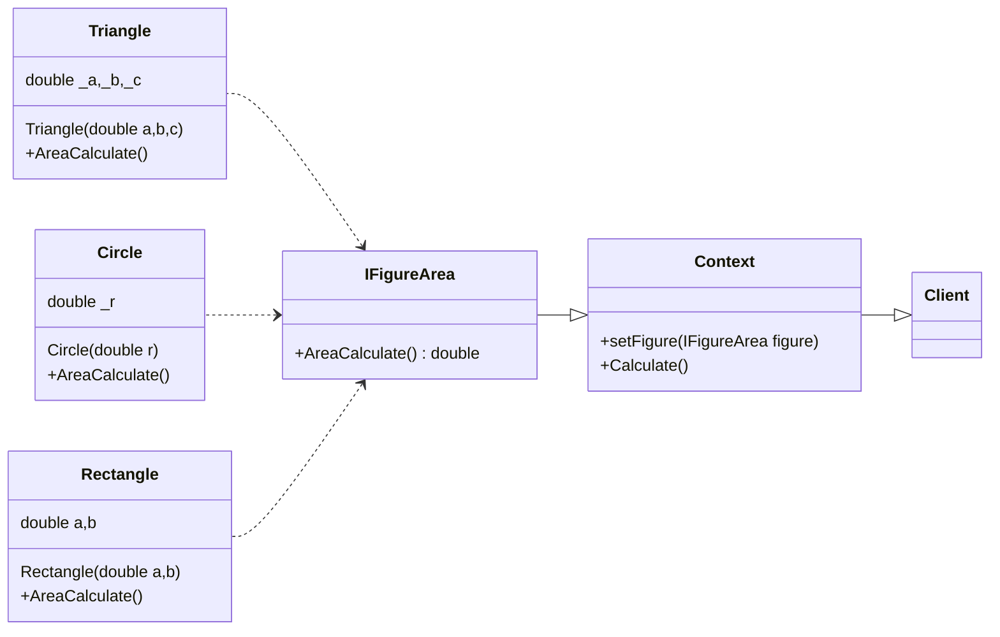

# Задача

Напишите на C# библиотеку для поставки внешним клиентам, которая умеет вычислять площадь круга по радиусу и треугольника по трем сторонам.

## Решение

Был применен паттерн Стратегия, с помощью которого определялись семейство схожих алгоритмов (в данном случае ФИГУР)
и вынесение их в собственные классы (см. dir. Service).
Контекст (FigureContext) ссылается на один из классов фигур и делегирует ей выполнение работы. Чтобы сменить фигуру, будет достаточно подставить в контекст другой объект фигуры.

Важно, чтобы все фигуры имеют общий интерфейс. Используя этот интерфейс, контекст будет независимым от конкретных классов фигур.
С другой стороны, имеется возможнось изменять и добавлять новые виды фигур, не трогая код контекста.

